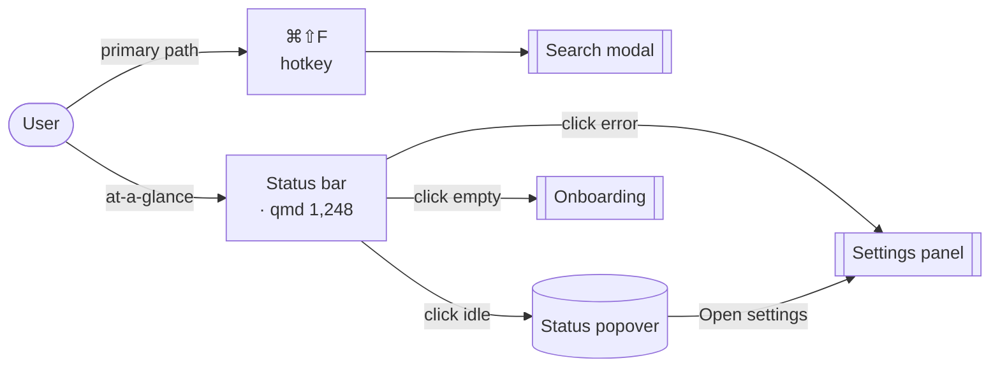
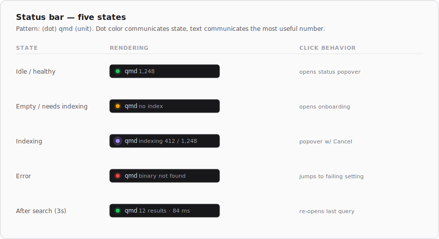
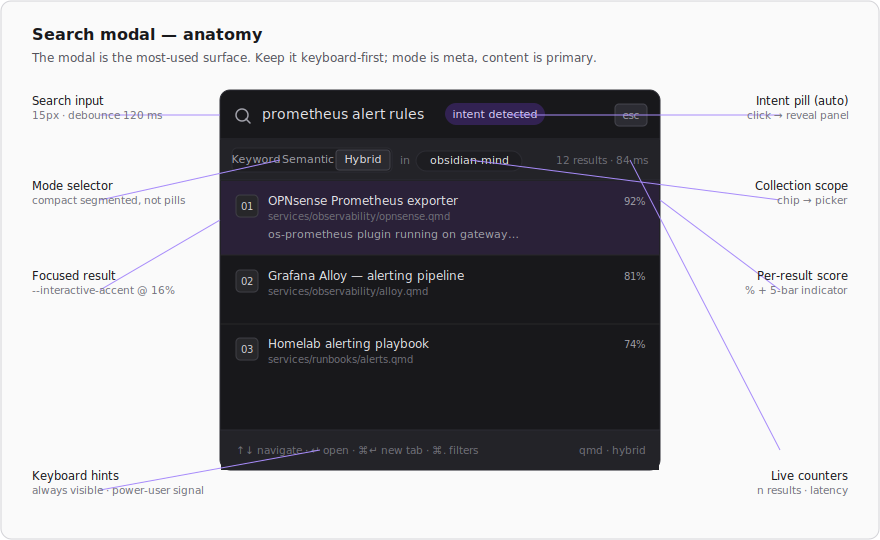
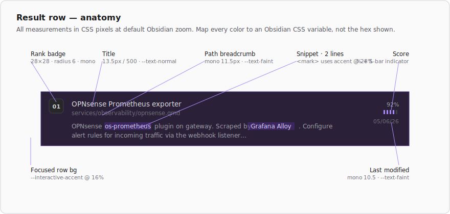

# QMD Search

[](../../releases/latest)
[](../../actions/workflows/ci.yml)
[](https://obsidian.md)
[](https://obsidian.md)
[](LICENSE)

**BM25 keyword · vector semantic · LLM-reranked hybrid search — running entirely on your machine.**

QMD Search wraps the [`qmd`](https://github.com/tobi/qmd) CLI to bring local hybrid search into Obsidian. No data leaves your machine. Models load on first query and stay warm.

> **Desktop only.** Requires the `qmd` CLI and at least one indexed collection.

---

## Quick start

```bash
# 1. Install qmd
npm install -g @tobilu/qmd

# 2. Index your vault
qmd collection add ~/path/to/vault --name my-vault
qmd embed
```

Then install the plugin (see [Installation](#installation)) and open the command palette → **QMD: Search**.

---

## How it works

The status bar item is the front door. The hotkey is the primary path.



---

## Status bar



The `qmd` item in Obsidian's status bar shows index health at a glance. The dot communicates state; the number communicates the most useful value.

| State | Dot | Label | Click |
|-------|-----|-------|-------|
| **Idle** | 🟢 green | doc count | Open status popover |
| **Empty** | 🟡 yellow | `no index` | Open onboarding |
| **Indexing** | 🟣 blue pulse | `indexing N / M` | Open status popover |
| **Error** | 🔴 red | `binary not found` | Open settings |
| **After search** | 🟢 green | `N results · Xms` | Re-open last query |

### Status popover

Click the status bar in idle or indexing state to open a floating panel showing document counts, collections, embedding coverage, last-indexed timestamp, and index size. Re-index and Open settings are in the footer. Dismiss with a click outside or `Esc`.

---

## Search



Open search with the **QMD: Search** command or a hotkey assigned in Settings → Hotkeys.

### Search modes

| Mode | How it works |
|------|-------------|
| **Keyword** | BM25 full-text — fast, exact-term matching |
| **Semantic** | Vector similarity — finds conceptually related passages even without exact terms |
| **Hybrid** | Both combined with LLM reranking — best results, slower on first run while models load |

### Result rows



Each result shows a **rank badge**, title, file path, matched snippet with highlighted terms, and a **score bar** (5-segment, proportional to relevance).

### Keyboard navigation

| Key | Action |
|-----|--------|
| `↑` / `↓` | Move between results |
| `↵` | Open in active pane |
| `⌘↵` / `Ctrl+↵` | Open in new tab |
| `Esc` | Close modal |

When no query is entered, the modal shows your **5 most recent queries** for instant replay.

---

## Settings

The settings panel renders differently depending on index state:

- **First run** (no collections) — a setup card with a **Register this vault** button. Runs `qmd collection add <vault> --name <name>` followed by `qmd embed`.
- **Healthy** — a stats panel (docs · collections · embeddings · last indexed) and a collections table. Each row has a `⋯` menu with Rename, Re-index, and Remove.

### Options

| Setting | Default | Description |
|---------|---------|-------------|
| `qmd binary path` | `qmd` | Full path to the `qmd` executable if not on PATH |
| `Transport mode` | CLI | **CLI** spawns a subprocess per query. **MCP HTTP** keeps a persistent daemon (faster after warm-up). |
| `MCP daemon port` | `8181` | Port for the MCP HTTP daemon |
| `Default collection` | *(all)* | Pre-selects a collection in the search modal |
| `Default search mode` | Hybrid | Mode the modal opens with |
| `Auto-reindex on save` | off | Re-indexes 30 s after a file is created, modified, or deleted |
| `Reindex delay` | 30 s | How long to wait after the last change before triggering a reindex (5–120 s) |
| `Log level` | error | Console verbosity: `off` · `error` · `warn` · `debug` |

---

## Onboarding

On first load (or when no collections exist), a 4-step checklist walks through setup:

1. **Binary detected** — confirms `qmd` is reachable
2. **Vault registered** — registers the current vault as a collection
3. **Build index** — runs `qmd update` + `qmd embed`
4. **Bind hotkey** — opens Settings → Hotkeys

Steps 1 and 2 auto-complete on plugin init. Skip marks the modal as done permanently.

---

## Commands

| Command | Runs | When to use |
|---------|------|-------------|
| **QMD: Search** | *(opens modal)* | Your primary entry point — open this to search |
| **QMD: Re-index collections** | `qmd update` | After adding, editing, or deleting notes. Updates the text index. Fast. Required for keyword search to see new content. |
| **QMD: Generate embeddings** | `qmd embed` | After re-indexing, to generate or refresh vector embeddings. Slower (loads the embedding model on first run). Required for semantic and hybrid search to see new content. |

**Typical maintenance workflow:** Re-index → then Embed. Auto-reindex (if enabled) handles Re-index automatically; run Embed manually after bulk changes.

All three commands are available from:
- **Command palette** (`Ctrl/Cmd+P` → "QMD")
- **Status bar popover** — Re-index and Embed buttons in the footer
- **Settings panel** — Re-index and Embed buttons in the health card; Re-index and Generate embeddings in each collection's `⋯` menu

---

## Installation

### Manual

1. Download `main.js`, `manifest.json`, and `styles.css` from the [latest release](../../releases/latest).
2. Copy them to `<vault>/.obsidian/plugins/obsidian-qmd-search/`.
3. Settings → Community plugins → enable **QMD Search**.

### BRAT (beta testing)

Install [BRAT](https://obsidian.md/plugins?id=obsidian42-brat), then add this repository URL to track releases from GitHub.

---

## Troubleshooting

**`binary not found` in status bar** — Obsidian's Electron process runs with a stripped PATH. Set the full binary path in settings (e.g. `/home/you/.npm-global/bin/qmd`). The plugin also probes common install locations automatically: `~/.nvm/versions/node/*/bin`, `~/.local/bin`, `~/.npm-global/bin`, `/usr/local/bin`.

**No results** — Run `qmd status` in a terminal to verify the index is healthy. Run `qmd update` or use the Re-index command if files are stale.

**MCP daemon fails to start** — Switch to CLI mode, or run `qmd mcp --http` in a terminal to see the error output directly.

**`qmd` silently fails or crashes after a Node.js update** — `qmd` uses `better-sqlite3`, a native Node.js addon compiled at install time. If you update Node.js (via nvm, asdf, or a system package manager), the compiled addon becomes an ABI mismatch. Reinstall `qmd` to recompile against the current Node version:

```bash
npm install -g @tobilu/qmd
```

If you use nvm and switch versions frequently, reinstall `qmd` after each switch, or pin a stable version with an `.nvmrc`.

---

## Development

```bash
git clone https://github.com/StevenWolfe/obsidian-qmd-search
cd obsidian-qmd-search
npm install
npm run build        # → main.js
npx tsc --noEmit     # type-check only
VAULT_PATH=~/path/to/vault npm run deploy
```

See [CLAUDE.md](CLAUDE.md) for architecture notes.

To cut a release: use the **Ship Release** workflow dispatch on GitHub (patch / minor / major). It bumps versions, builds, commits, tags, and publishes the GitHub release automatically.

---

## License

MIT — see [LICENSE](LICENSE).
